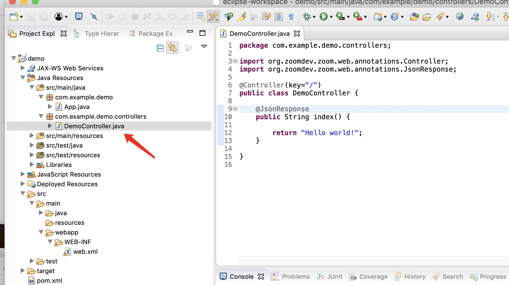
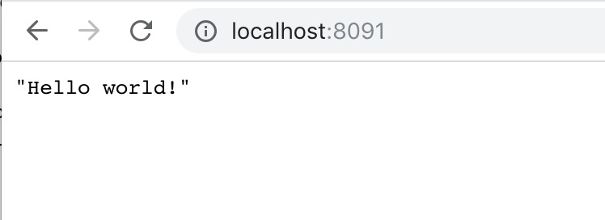

# Hello world

1、新建DemoController,注意包名必须为controllers,`Zoom` 约定Controller必须放在controllers目录



```java
package com.example.demo.controllers;

import org.zoomdev.zoom.web.annotations.Controller;
import org.zoomdev.zoom.web.annotations.JsonResponse;
import org.zoomdev.zoom.web.annotations.Mapping;

@Controller(key="/")
public class DemoController {

	@Mapping("")
	@JsonResponse
	public String index() {

		return "Hello world!";
	}

}


```

在这段程序里面，`@Controller`标注表示这个类是一个Controller。

key属性表示的是Controller的Base Url，在默认情况下Controller中的每一个public的非静态方法都将被解析为一个url。计算方法为 key / 方法名称。

`@Mapping`这个标注将改变默认的计算方法，所以增加这个标注之后，url为 key / Mapping.value()。

`@JsonResponse`这个标注表示，本方法返回的数据将被解析成为json字符串。


打开浏览器,输入网址: http://localhost:8091/

